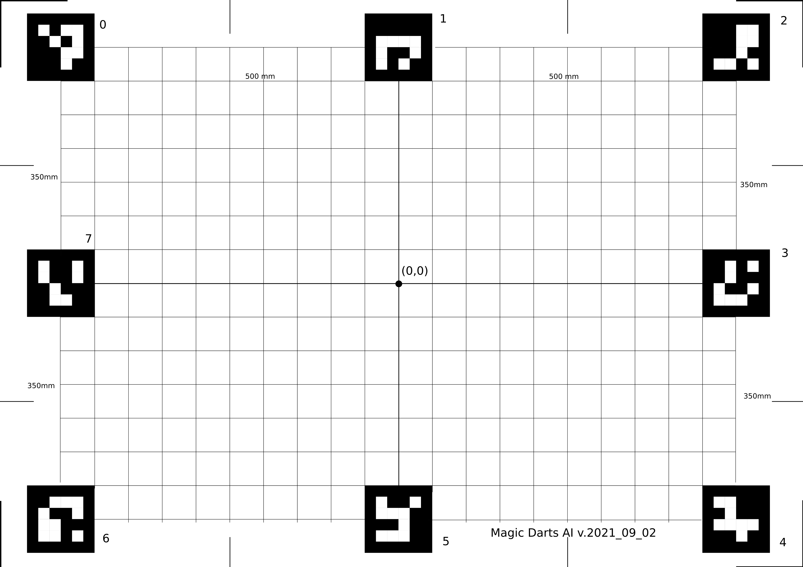
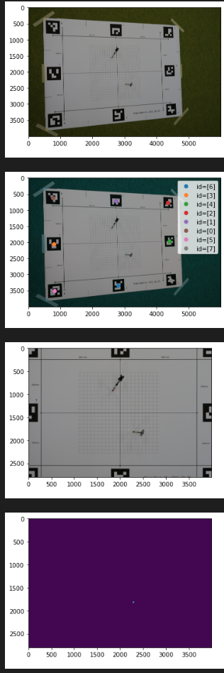
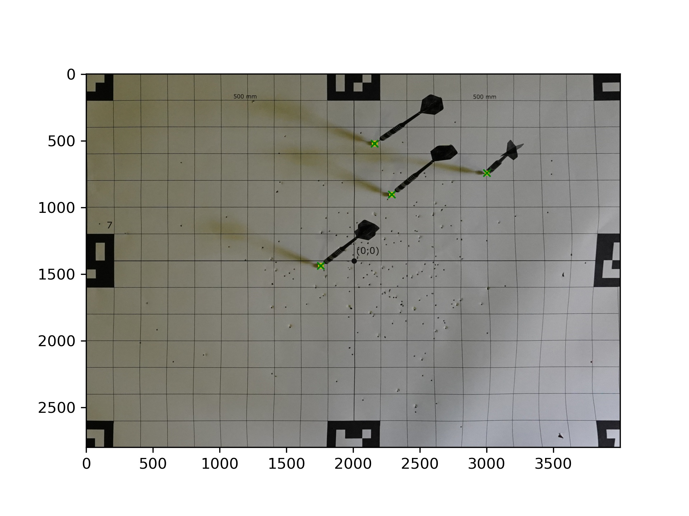

# DartDetection

This repo contains a python implementation for detecting darts on a DIN A0 poster surrounded by aruco markers.



## Detection pipeline



## Usage

The filenames in the directory, where the input images are located should have the following format:

``` python
filename=f"magictest-{datetime.datetime.now():%Y%m%d-%H%M%S}-{series_id}-{throw_id}-camera-{anynumber}.JPG"
```

e.g. magictest-20210904-163555-1-0-camera-00007.JPG

(see folder ./test_shots/)

### Run detection

Use the following command to run the script:

``
python3 detect_dart.py --path /path/to/folder
``

If ``--path`` is not specified the script will look in the folder of the file.

## Output

The rectified images with the detected darts annotated by crosses:



Filename image example: magictest-20210904-163604-1-4-camerarect.jpg


The yaml-files have the format: 
coordinate system: x -> right, positive, y -> up, positive

``` yaml
detection_valid: 1
radius: 0.0032344627380371093 # in metres
series_id: 1
throw_id: 4
x: 0.25064935302734376 # in metres
y: 0.16417008972167968 # in metres
```

Filename yaml example: 
magictest-20210904-163604-1-4-position.yaml